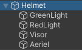

Right-click in the Hierarchy window and select 'Create Empty' 3D Object then give the new GameObject a sensible name.  

Right-click your new 3D shape and add other 3D shapes from 'Create' -> '3D Object' as child game objects. The child objects will move with the first 3D shape GameObject. 

Bring your shapes to life by dragging Materials from the Project window to the shape in the Scene view. 

This helmet has a sphere with child GameObjects that are spheres, a capsule and a cylinder. The shapes have been renamed to the part of the helmet they represent and coloured with Materials. 

