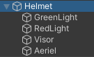

Fais un clic droit dans la fenêtre Hierarchy et sélectionne **Create Empty** puis donne un nom approprié au nouveau GameObject.

Fais un clic droit sur ta nouvelle forme 3D et ajoute d'autres formes 3D à partir de **Create** > **3D Object** en tant que GameObjects enfants. Les objets enfants se déplaceront avec la première forme 3D GameObject.

Donne vie à tes formes en faisant glisser les matériaux de la fenêtre Project vers la forme dans la vue Scene.

Ce casque a une sphère avec des GameObjects enfants qui sont des sphères, une capsule et un cylindre. Les formes ont été renommées pour refléter la partie du casque qu'elles représentent et colorées avec des matériaux.

