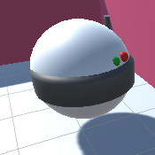

Klik met de rechtermuisknop in het Hierarchy venster en selecteer **Create Empty** 3D-object en geef het nieuwe GameObject een logische naam.

Klik met de rechtermuisknop op je nieuwe 3D-vorm en voeg andere 3D-vormen toe vanuit **Create** > **3D Object** als onderliggende game objects. De onderliggende objecten bewegen mee met het eerste GameObject.

Breng je vormen tot leven door materialen uit het projectvenster naar de vorm in de scèneweergave te slepen.

Deze helm heeft een bol met onderliggende GameObjects, dit zijn bollen, een capsule en een cilinder. De vormen zijn hernoemd om het deel van de helm weer te geven dat ze vertegenwoordigen en gekleurd met materialen.

